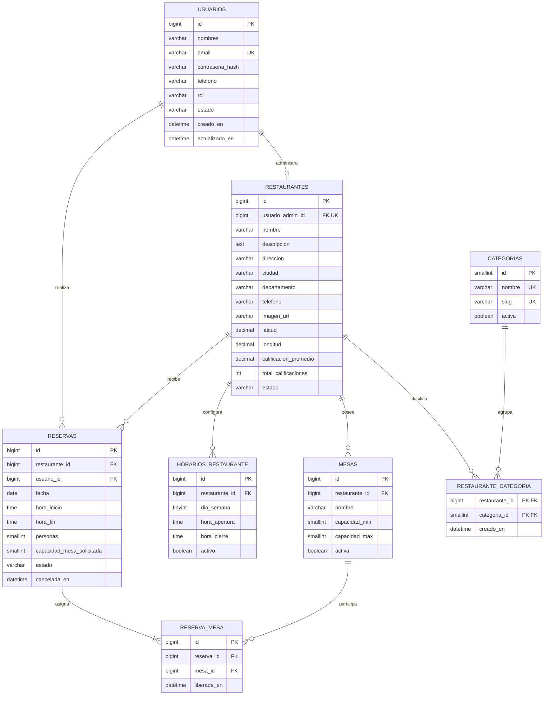

# Modelo entidad–relación de InnovaRest

## Decisiones del modelo

- Un usuario con rol `RESTAURANTE` administra como máximo un restaurante.
- Un restaurante puede aparecer en varias categorías.
- El horario se registra por día de la semana, del 1 (lunes) al 7 (domingo).
- El cliente selecciona una capacidad; la mesa específica se asigna en el backend.
- Una reserva confirmada debe tener entre una y tres mesas.
- `liberada_en` permite registrar que una mesa fue liberada antes del final previsto.
- Cancelar una reserva no elimina registros y deja de bloquear sus mesas.
- Las estadísticas se calculan desde las reservas; no necesitan una tabla propia.

